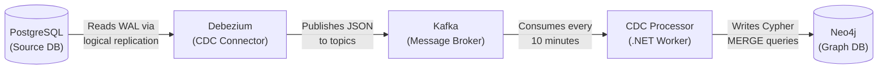
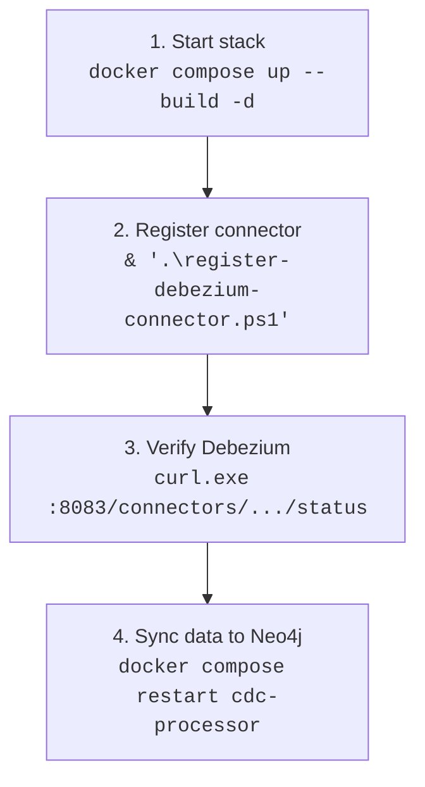
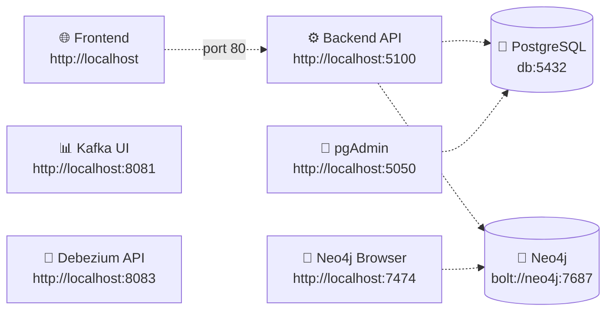

# feat. Neo4j & CDC Pipeline — Session Report

> **Date:** 2026-07-22  
> **Branch:** `backend/feature/neo4j`  
> **Goal:** Fix Neo4j data persistence, register Debezium connector, document CDC pipeline, and automate connector registration.

---

## Summary

This session focused on three areas: (1) fixing Neo4j's Docker data volume so `docker compose down -v` properly wipes graph data, (2) registering and verifying the Debezium PostgreSQL connector to stream changes into Neo4j, and (3) creating beginner-friendly documentation and an automation script for the connector setup.

---

## Files Created

### `register-debezium-connector.ps1` — *New*

A PowerShell script that registers the Debezium PostgreSQL connector via Kafka Connect's REST API.

**What it does:**
- Builds the connector JSON configuration using PowerShell objects (avoids the quoting issues that `curl.exe` has in PowerShell)
- Sends a `POST` request to `http://localhost:8083/connectors`
- Handles the case where the connector already exists (HTTP 409) gracefully
- Prints the connector's current status after registration

**How to use:**
```powershell
& ".\register-debezium-connector.ps1"
```

Run this after `docker compose up` once all services (especially Debezium) are healthy.

### `high-level explanation\STARS-CDC-Explained.html` — *New (not tracked in git)*

A self-contained HTML file that explains the entire CDC pipeline in beginner-friendly terms.

**Contents (5 sections):**
1. **The Data Pipeline: PostgreSQL → Neo4j** — Step-by-step overview of how data flows through the system
2. **Docker Compose Service Configurations** — Line-by-line breakdown of every setting in the `neo4j`, `kafka`, `debezium`, and `cdc-processor` services
3. **The Architecture Diagram Explained** — What each box and arrow in the flow diagram means
4. **No Direct PostgreSQL-to-Neo4j Connection** — Clarification of the reading side (PostgreSQL → Debezium → Kafka → CDC Processor) vs. the writing side (CDC Processor → Neo4j)
5. **Source Code Line-by-Line Explanation** — Full walkthrough of all code blocks from `Neo4j-CDC-Deliverable.html`

Open in any browser: `high-level explanation\STARS-CDC-Explained.html`

### `SESSION-REPORT-Neo4j-CDC-Setup.md` — *New (this file)*

The file you are reading now.

---

## Files Modified

### `docker-compose.yml`

**Change 1 — Neo4j data volume (line 76):**

```diff
-      - ./neo4j-data:/data
+      - neo4j-data:/data
```

The old configuration used a **bind mount** (`./neo4j-data` on the host filesystem). Bind mounts are **not removed** by `docker compose down -v`, so Neo4j data survived every teardown.

The new configuration uses a **Docker named volume** (`neo4j-data`). Named volumes **are removed** by `docker compose down -v`, giving a clean Neo4j database on the next `up`.

**Change 2 — Volumes declaration (bottom of file):**

```diff
 volumes:
   pgdata:
-  kafka-data:
+  kafka-data:
+  neo4j-data:
```

Added `neo4j-data` to the named volumes section so Docker Compose manages it. Without this declaration, referencing a named volume in a service would cause an error.

### `README.md`

Resolved a merge conflict during the `git pull` that had left the branch in a divergent state. The conflict was in the README and was resolved by keeping the updated remote content.

---

## What Was Done (In Order)

### 1. Diagnosed Neo4j Data Persistence Issue

**Problem:** `docker compose down -v` did not clear Neo4j data because it was stored in a bind mount (`./neo4j-data:/data`) — a host directory that Docker does not manage.

**Fix:** Changed to a named volume so `docker compose down -v` properly wipes Neo4j along with the other volumes.

### 2. Rebuilt and Started the Stack

Ran `docker compose up --build` to rebuild all custom images (backend, frontend, cdc-processor) and start all 9 services. Verified all containers reached healthy status.

### 3. Registered the Debezium Connector

Sent the connector configuration to Debezium's REST API at `http://localhost:8083/connectors`. This tells Debezium to:
- Connect to PostgreSQL at `db:5432`
- Watch the `backend_db` database
- Subscribe to the `stars_cdc` publication
- Publish all row changes to Kafka topics prefixed with `stars.public.`

Debezium performed an **initial snapshot** — it read all existing data from PostgreSQL and emitted events with `"op": "r"` (read/snapshot).

### 4. Verified Kafka Topics

Kafka topics were automatically created:
- `stars.public.Users`
- `stars.public.Departments`
- `stars.public.JobPositions`
- `stars.public.NotificationSettings`

Topics for `Tasks`, `TaskAssignments`, and `Recommendations` were not created because those tables had no data yet.

### 5. Triggered CDC Processor Sync

Restarted the `cdc-processor` container to trigger an immediate sync cycle (instead of waiting the default 10 minutes). The processor:
- Consumed **13 CDC events** from `stars.public.Users` and `stars.public.Departments`
- Wrote **9 Employee nodes** and **4 Department nodes** to Neo4j with derived properties (workload, scores, etc.)

### 6. Resolved Git Divergence

The local branch had diverged from `origin/backend/feature/neo4j` (1 local commit vs. 5 remote commits). A `git pull` had created a merge conflict in `README.md` that was resolved but never committed, leaving the repository in a "still merging" state that blocked all pushes.

**Fix:** Completed the merge commit and pushed the combined history to the remote.

### 7. Created Automation Script

Wrote `register-debezium-connector.ps1` so the connector can be registered with a single command instead of remembering the curl syntax.

### 8. Created Documentation

Built a comprehensive HTML guide (`high-level explanation/STARS-CDC-Explained.html`) that explains the entire CDC pipeline in beginner-friendly terms, from architecture diagrams down to line-by-line source code explanations.

---

## Pipeline Architecture



| Component | Role | Port |
|-----------|------|------|
| PostgreSQL | Source of truth; stores all app data (Users, Tasks, etc.) | 5432 |
| Debezium | Reads PostgreSQL's WAL log; publishes changes as JSON to Kafka | 8083 |
| Kafka | Message broker; stores CDC events in topics (`stars.public.*`) | 9092 |
| CDC Processor | .NET Worker; polls Kafka every 10 min, computes derived insights (workload, scores), writes to Neo4j | — |
| Neo4j | Graph database; stores Employee, Department, Task nodes with relationships | 7474 (UI), 7687 (Bolt) |

### Services in `docker-compose.yml`

| Service | Image | Purpose |
|---------|-------|---------|
| `db` | `postgres:16-alpine` | PostgreSQL with logical replication enabled |
| `neo4j` | `neo4j:latest` | Graph DB with APOC plugin |
| `kafka` | `apache/kafka:latest` | Message broker (KRaft mode, no ZooKeeper) |
| `debezium` | `quay.io/debezium/connect:latest` | Kafka Connect worker with PostgreSQL connector |
| `kafka-ui` | `provectuslabs/kafka-ui:latest` | Kafka web UI (`http://localhost:8081`) |
| `cdc-processor` | Custom build (`./cdc-processor`) | .NET 9 Worker — reads Kafka, writes Neo4j |
| `backend` | Custom build (`./backend`) | ASP.NET 9 REST API |
| `frontend` | Custom build (`./frontend`) | React SPA served via Nginx |
| `pgadmin` | `dpage/pgadmin4:latest` | PostgreSQL admin UI (`http://localhost:5050`) |

---

## How to Run



### Commands

```powershell
# Start everything in the background
docker compose up --build -d

# Register Debezium connector (required after down -v)
& ".\register-debezium-connector.ps1"

# Force CDC Processor to sync immediately
docker compose restart cdc-processor

# Wipe all data and start fresh
docker compose down -v
docker compose up --build -d
```

---

## System URLs



| Service | URL | Description |
|---------|-----|-------------|
| **Frontend (Web App)** | **`http://localhost`** | The main STARS application UI (React SPA served via Nginx) |
| **Backend API (Swagger)** | **`http://localhost:5100/swagger`** | The REST API with Swagger UI for testing endpoints |
| **Backend API (Direct)** | **`http://localhost:5100`** | The ASP.NET backend API |
| **pgAdmin (PostgreSQL)** | **`http://localhost:5050`** | DB management UI. Login: `stars@admin.com` / `starslab!`. Add server: host=`db`, port=`5432`, user=`postgres`, password=`postgres` |
| **Neo4j Browser** | **`http://localhost:7474`** | Graph DB web interface. Login: `neo4j` / `starslab!` |
| **Kafka UI** | **`http://localhost:8081`** | Browse topics and messages |
| **Debezium API** | **`http://localhost:8083`** | Kafka Connect REST API |

---

## Key Commands Reference

```powershell
# Container status
docker compose ps

# View CDC Processor logs
docker compose logs cdc-processor

# Check Debezium connector status
curl.exe http://localhost:8083/connectors/stars-postgres-connector/status

# View Kafka messages for Users table
docker compose exec kafka /opt/kafka/bin/kafka-console-consumer.sh `
  --bootstrap-server localhost:9092 `
  --topic stars.public.Users `
  --from-beginning

# Check Neo4j data count
docker compose exec neo4j cypher-shell -u neo4j -p starslab! `
  "MATCH (n) RETURN labels(n) AS Label, count(*) AS Count ORDER BY Count DESC"
```

---

## Verification Checklist

- [ ] All 9 containers are running (`docker compose ps`)
- [ ] Debezium connector is `RUNNING` (`curl.exe http://localhost:8083/connectors/stars-postgres-connector/status`)
- [ ] Kafka topics exist (`docker compose exec kafka /opt/kafka/bin/kafka-topics.sh --bootstrap-server localhost:9092 --list`)
- [ ] Neo4j has data (`MATCH (n) RETURN labels(n), count(*)` shows Employee and Department nodes)
- [ ] CDC Processor logs show `"CDC sync cycle completed"` with events processed

---

## Notes

- **The `high-level explanation/` folder is NOT tracked in git.** It contains local documentation only. If you want to commit it, run `git add "high-level explanation/"` explicitly.
- **The Debezium connector must be re-registered after every `docker compose down -v`** because the offset topic (`stars-connect-offsets`) is wiped along with the volumes. The `register-debezium-connector.ps1` script automates this.
- **The CDC Processor polls every 10 minutes** by default. Use `docker compose restart cdc-processor` to force an immediate sync.
- **Data only flows for tables that have records.** If a table is empty in PostgreSQL, Debezium won't create a Kafka topic for it.
