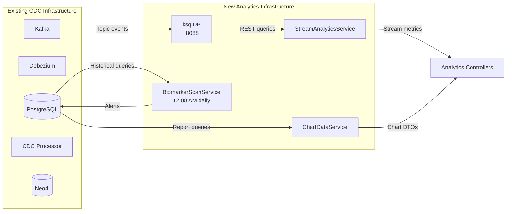
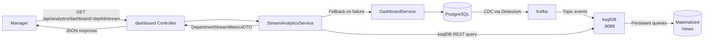
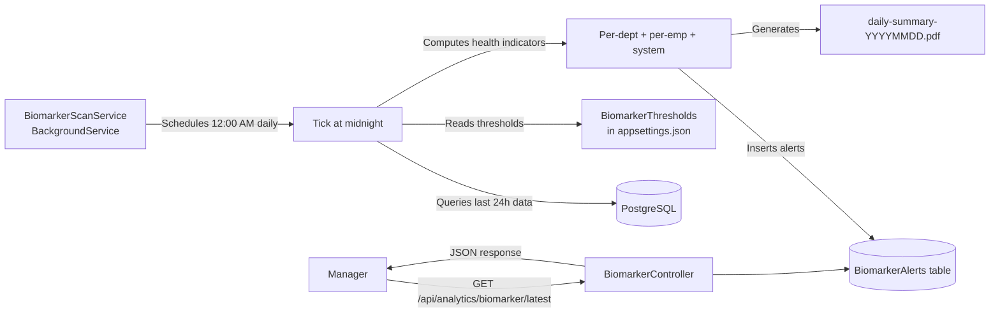

# Analytics Module Implementation Plan — Real-Time Stream & Batch Analytics

> **Source:** `notes/AI-ANALYTICS-1.pdf` — Analytics section only (pages 2-3)  
> **Branch:** `backend/feature/analytics`  
> **Stack:** .NET 9, Apache Kafka, ksqlDB, PostgreSQL, ClosedXML, QuestPDF, xUnit  

---

## 1. Goal

Implement the two Analytics components prescribed in the PDF:

1. **Real-Time Stream Analytics (via Kafka & ksqlDB)** — Replace database queries on dashboard refresh with continuous stream processing. Satisfies FR-038 (instant dashboard updates).
2. **Descriptive Batch Analytics (via Background Worker)** — Implement the nightly automated Biomarker Scan (FR-050) and enhance the existing Excel/PDF export system (FR-041).

Both components complement the existing `ReportService`, `DashboardService`, and `OverdueCheckService` — none of the existing services are replaced, only augmented.

---

## 2. Current State (From Codebase Audit)

| Aspect | Status |
|--------|--------|
| Kafka broker in Docker Compose (KRaft mode, port 9092) | ✅ Topic `stars.public.*` already receiving CDC events |
| Debezium PostgreSQL connector (streams row changes to Kafka) | ✅ Registered via REST API |
| `DashboardService` — real-time metrics from PostgreSQL | ✅ But queries PostgreSQL directly (no stream processing) |
| `DashboardController` — `/api/dashboard/*` endpoints | ✅ Exists |
| `ReportService` — KPI tracking, performance reports, Excel/PDF export | ✅ Exists |
| `ReportController` — `/api/reports/*` endpoints | ✅ Exists |
| `OverdueCheckService` — polls every 15 min for overdue tasks | ✅ BackgroundService |
| `FomsExportService` — CSV export of completed tasks | ✅ Exists |
| ksqlDB in Docker Compose | ❌ Not present |
| Nightly Automated Biomarker Scan (FR-050) | ❌ Not implemented |
| Time-series / trend / period-over-period comparison | ❌ Not supported |
| Chart-ready DTOs for frontend visualization | ❌ Not implemented |
| Department-level KPI in reports | ❌ Only employee-level |
| `RevisedDeadline` consistency across services | ❌ ReportService uses it; Dashboard/Overdue do not |

---

## 3. Design Decisions

### 3.1 Stream Processing — ksqlDB

- **Why ksqlDB instead of raw Kafka consumer:** ksqlDB runs SQL-like queries directly on Kafka topics, creating materialized views that update incrementally as events arrive. The alternative (raw consumer in .NET) would require us to manually aggregate, store state, handle offsets, and manage consistency — essentially reimplementing ksqlDB.
- **Deployment:** Added as a service in `docker-compose.yml` alongside the existing Kafka broker. ksqlDB connects to the same Kafka cluster and creates persistent queries that run continuously.
- **What it produces:** Materialized tables that the backend queries via ksqlDB's REST API. These tables are always up-to-date (eventually consistent, sub-second latency).
- **Not a replacement:** The existing `DashboardService` continues to work via PostgreSQL for backward compatibility. The new stream endpoints are additive.

### 3.2 Batch Analytics — Nightly Scan

- BackgroundService (`BiomarkerScanService`) runs daily at 12:00 AM with a configurable cron expression.
- Computes department-level and employee-level health indicators from the last 24 hours of activity.
- Stores results in a new `BiomarkerAlert` table (not just logged as notifications).
- Generates a daily summary PDF/Excel report.

### 3.3 Chart-Ready DTOs

- New DTOs designed for popular chart libraries (Chart.js, ApexCharts, Recharts with their typical `{ labels[], datasets[] }` shape).
- Decoupled from `DashboardMetricsDTO` — stream data returns incremental deltas, not full snapshots.

### 3.4 Authorization

| Endpoint Group | Policy | Rationale |
|---------------|--------|-----------|
| `/api/analytics/dashboard/*` (stream) | `ManagerOnly` | Real-time operational intelligence is management-only |
| `/api/analytics/reports/*` | `CoordinatorAndAbove` | Existing report access (Coordinators scoped to own dept) |
| `/api/analytics/biomarker/*` | `ManagerOnly` | Nightly health scan results are sensitive |
| `/api/analytics/export/*` | `CoordinatorAndAbove` | Existing export access |
| `/api/analytics/trends/*` | `ManagerOnly` | Trend/historical data |

---

## 4. Implementation Tasks (Ordered)

### Task 1 — Add ksqlDB to Docker Compose

**File:** `docker-compose.yml` (MODIFY)

Add service:
```yaml
ksqldb:
  image: confluentinc/ksqldb-server:latest
  container_name: ksqldb
  restart: unless-stopped
  ports:
    - "8088:8088"
  environment:
    KSQL_BOOTSTRAP_SERVERS: kafka:9092
    KSQL_LISTENERS: http://0.0.0.0:8088
    KSQL_KSQL_SERVICE_ID: stars-ksql
    KSQL_KSQL_QUERIES_FILE: /etc/ksql/queries.sql
    KSQL_KSQL_STREAMS_AUTO_OFFSET_RESET: earliest
  volumes:
    - ./ksql-queries.sql:/etc/ksql/queries.sql
  depends_on:
    kafka:
      condition: service_healthy
```

Add ksqlDB CLI for manual inspection:
```yaml
ksqldb-cli:
  image: confluentinc/ksqldb-cli:latest
  container_name: ksqldb-cli
  restart: "no"
  depends_on:
    - ksqldb
  entrypoint: /bin/sh
  tty: true
```

### Task 2 — Create ksqlDB Stream Definitions

**File:** `ksql-queries.sql` (NEW — project root)

Define streams from existing Kafka topics:

```sql
-- Stream: raw CDC events from Debezium
CREATE OR REPLACE STREAM task_events (
    op VARCHAR,
    before STRUCT<Id VARCHAR, Title VARCHAR, Status INT, PriorityLevel INT, Classification INT, Deadline VARCHAR, AssignedDepartmentId VARCHAR, CreatedAt VARCHAR, UpdatedAt VARCHAR, RevisedDeadline VARCHAR>,
    after STRUCT<Id VARCHAR, Title VARCHAR, Status INT, PriorityLevel INT, Classification INT, Deadline VARCHAR, AssignedDepartmentId VARCHAR, CreatedAt VARCHAR, UpdatedAt VARCHAR, RevisedDeadline VARCHAR>,
    source STRUCT<table VARCHAR, db VARCHAR>
) WITH (
    KAFKA_TOPIC='stars.public.Tasks',
    VALUE_FORMAT='JSON'
);

-- Stream: filtered to status changes only
CREATE OR REPLACE STREAM task_status_changes AS
    SELECT
        after->Id AS task_id,
        after->Title AS title,
        before->Status AS previous_status,
        after->Status AS new_status,
        after->PriorityLevel AS priority,
        after->Classification AS classification,
        after->AssignedDepartmentId AS department_id,
        PARSE_TIMESTAMP(after->CreatedAt, 'yyyy-MM-dd''T''HH:mm:ss') AS event_time
    FROM task_events
    WHERE op = 'u'
      AND before->Status IS NOT NULL
      AND before->Status <> after->Status;

-- Materialized table: task completion rate per department (last 1 hour)
CREATE OR REPLACE TABLE dept_completion_rate AS
    SELECT
        department_id,
        COUNT(*) FILTER (WHERE new_status = 3) AS completed_count,
        COUNT(*) AS total_count,
        (COUNT(*) FILTER (WHERE new_status = 3) * 100.0 / COUNT(*)) AS completion_rate
    FROM task_status_changes
    WINDOW TUMBLING (SIZE 1 HOUR)
    GROUP BY department_id;

-- Materialized table: overdue tasks by department
CREATE OR REPLACE TABLE dept_overdue_alerts AS
    SELECT
        department_id,
        COUNT(*) AS overdue_count,
        COLLECT_LIST(title) AS task_titles
    FROM task_status_changes
    WHERE new_status NOT IN (3, 4)  -- not Completed, not Cancelled
    WINDOW TUMBLING (SIZE 15 MINUTES)
    GROUP BY department_id;
```

Additional streams for `Users` (employee availability changes) and `TaskAssignments` (workload changes) follow the same pattern.

### Task 3 — Add `ksqlDB.RestApi.Client` NuGet Package

**File:** `backend/Backend.csproj` (MODIFY)

```xml
<PackageReference Include="ksqlDB.RestApi.Client" Version="7.0.0" />
```

This library provides a LINQ-based client for ksqlDB queries, returning strongly-typed results.

### Task 4 — Create Analytics Module and Namespace

**Directory:** `backend/Modules/Analytics/` (NEW)

Separate analytics concerns from `TaskManagement`:
- `backend/Modules/Analytics/StreamAnalyticsService.cs`
- `backend/Modules/Analytics/IStreamAnalyticsService.cs`
- `backend/Modules/Analytics/BiomarkerScanService.cs`
- `backend/Modules/Analytics/ChartDataService.cs`

### Task 5 — Create Stream Analytics Service

**File:** `backend/Modules/Analytics/IStreamAnalyticsService.cs` (NEW)

```csharp
namespace Backend.Modules.Analytics;

public interface IStreamAnalyticsService
{
    Task<DepartmentStreamMetricsDTO> GetDepartmentCompletionRateAsync(Guid departmentId);
    Task<List<OverdueAlertDTO>> GetOverdueAlertsAsync(Guid? departmentId = null);
    Task<WorkloadStreamDTO> GetLiveWorkloadAsync(Guid departmentId);
}
```

**File:** `backend/Modules/Analytics/StreamAnalyticsService.cs` (NEW)

- Connects to ksqlDB at `http://ksqldb:8088` via `ksqlDB.RestApi.Client`.
- Queries materialized tables (e.g., `SELECT * FROM dept_completion_rate WHERE department_id = :id;`).
- Falls back to PostgreSQL `DashboardService` if ksqlDB is unavailable.
- Returns data suitable for frontend polling (~5-10 second refresh interval).

### Task 6 — Create Chart-Ready DTOs

**File:** `backend/Models/DTOs/ChartDataDTO.cs` (NEW)

```csharp
namespace Backend.Models.DTOs;

public class ChartDataDTO
{
    public List<string> Labels { get; set; } = new();
    public List<ChartDatasetDTO> Datasets { get; set; } = new();
}

public class ChartDatasetDTO
{
    public string Label { get; set; } = string.Empty;
    public List<double> Data { get; set; } = new();
    public string BackgroundColor { get; set; } = string.Empty;
    public string BorderColor { get; set; } = string.Empty;
}

public class DepartmentStreamMetricsDTO
{
    public Guid DepartmentId { get; set; }
    public string DepartmentName { get; set; } = string.Empty;
    public int CompletedLastHour { get; set; }
    public int TotalLastHour { get; set; }
    public double CompletionRate { get; set; }
    public int OverdueCount { get; set; }
    public int ActiveTasks { get; set; }
    public DateTime LastUpdated { get; set; }
}

public class OverdueAlertDTO
{
    public Guid DepartmentId { get; set; }
    public string DepartmentName { get; set; } = string.Empty;
    public int OverdueCount { get; set; }
    public List<string> TaskTitles { get; set; } = new();
    public DateTime WindowStart { get; set; }
}

public class WorkloadStreamDTO
{
    public Guid DepartmentId { get; set; }
    public int ActiveTaskCount { get; set; }
    public int DistinctEmployeesAssigned { get; set; }
    public double AvgTasksPerEmployee { get; set; }
    public DateTime LastUpdated { get; set; }
}

public class TrendDataDTO
{
    public string PeriodLabel { get; set; } = string.Empty;
    public int OnTimeCount { get; set; }
    public int LateCount { get; set; }
    public int TotalCompleted { get; set; }
    public double OnTimeRate { get; set; }
}
```

### Task 7 — Create Analytics Controllers

**File:** `backend/Controllers/AnalyticsDashboardController.cs` (NEW)

Stream analytics endpoints:
```csharp
[ApiController]
[Route("api/analytics")]
[Authorize]
public class AnalyticsDashboardController : ControllerBase
{
    [HttpGet("dashboard/department/{deptId:guid}/stream")]
    [Authorize(Policy = AuthorizationPolicies.ManagerOnly)]
    public async Task<IActionResult> GetDepartmentStreamMetrics(Guid deptId) { ... }

    [HttpGet("dashboard/overdue")]
    [Authorize(Policy = AuthorizationPolicies.ManagerOnly)]
    public async Task<IActionResult> GetOverdueAlerts() { ... }

    [HttpGet("dashboard/workload/stream")]
    [Authorize(Policy = AuthorizationPolicies.ManagerOnly)]
    public async Task<IActionResult> GetLiveWorkload() { ... }
}
```

**File:** `backend/Controllers/AnalyticsBiomarkerController.cs` (NEW)

Nightly scan endpoints:
```csharp
[ApiController]
[Route("api/analytics/biomarker")]
[Authorize(Policy = AuthorizationPolicies.ManagerOnly)]
public class AnalyticsBiomarkerController : ControllerBase
{
    [HttpGet("latest")]
    public async Task<IActionResult> GetLatestBiomarkerResults() { ... }

    [HttpGet("history")]
    public async Task<IActionResult> GetBiomarkerHistory([FromQuery] DateTime? from, [FromQuery] DateTime? to) { ... }
}
```

**File:** `backend/Controllers/AnalyticsTrendController.cs` (NEW)

Trend/historical endpoints (reuse existing `ReportService` but with new DTOs):
```csharp
[ApiController]
[Route("api/analytics/trends")]
[Authorize(Policy = AuthorizationPolicies.ManagerOnly)]
public class AnalyticsTrendController : ControllerBase
{
    [HttpGet("weekly")]
    public async Task<IActionResult> GetWeeklyTrend() { ... }

    [HttpGet("department/{deptId:guid}")]
    public async Task<IActionResult> GetDepartmentTrend(Guid deptId, [FromQuery] int weeks = 4) { ... }

    [HttpGet("chart/completion-rate")]
    public async Task<IActionResult> GetCompletionRateChartData([FromQuery] int weeks = 4) { ... }
}
```

### Task 8 — Create `BiomarkerAlert` Model and DB Table

**File:** `backend/Models/BiomarkerAlert.cs` (NEW)

```csharp
namespace Backend.Models;

public class BiomarkerAlert
{
    public Guid Id { get; set; } = Guid.NewGuid();
    public DateTime ScanDateTime { get; set; }                // 12:00 AM timestamp
    public DateTime ScanDate { get; set; }                    // Date scanned
    public Guid? DepartmentId { get; set; }
    public string DepartmentName { get; set; } = string.Empty;
    public string MetricName { get; set; } = string.Empty;     // e.g., "OnTimeRate", "OverdueBacklog"
    public double CurrentValue { get; set; }
    public double ThresholdValue { get; set; }
    public string Severity { get; set; } = "Info";             // Info, Warning, Critical
    public string Description { get; set; } = string.Empty;
    public bool IsAcknowledged { get; set; } = false;
    public DateTime CreatedAt { get; set; } = DateTime.UtcNow;
}
```

Register in `AppDbContext`:
```csharp
public DbSet<BiomarkerAlert> BiomarkerAlerts { get; set; }
```

### Task 9 — Create Biomarker Scan Service

**File:** `backend/Modules/Analytics/BiomarkerScanService.cs` (NEW)

```csharp
public class BiomarkerScanService : BackgroundService
{
    protected override async Task ExecuteAsync(CancellationToken stoppingToken)
    {
        while (!stoppingToken.IsCancellationRequested)
        {
            var nextMidnight = DateTime.Today.AddDays(1); // 12:00 AM tomorrow
            var delay = nextMidnight - DateTime.UtcNow;
            if (delay > TimeSpan.Zero)
                await Task.Delay(delay, stoppingToken);

            await RunBiomarkerScanAsync(DateTime.UtcNow.Date);
        }
    }

    private async Task RunBiomarkerScanAsync(DateTime scanDate)
    {
        // 1. Department-level metrics
        //    - On-time completion rate per department (last 24h)
        //    - Overdue backlog per department
        //    - Avg task completion time per department
        // 2. Employee-level metrics
        //    - Employees with 0 completed tasks in last 7 days
        //    - Employees with > 50% late rate in last 7 days
        //    - Employees with workload > threshold
        // 3. System-level metrics
        //    - Total active tasks across system
        //    - Overall SLA compliance rate
        //    - Tasks stuck "InProgress" > 48h without update
        // 4. Compare each metric against configured thresholds
        // 5. Generate BiomarkerAlert records for exceeded thresholds
        // 6. Generate daily PDF summary report
    }
}
```

**Register in `Program.cs`:**
```csharp
builder.Services.AddHostedService<BiomarkerScanService>();
```

### Task 10 — Add Biomarker Threshold Configuration

**File:** `backend/Models/BiomarkerThresholds.cs` (NEW)

```csharp
namespace Backend.Models;

public class BiomarkerThresholds
{
    public double MinOnTimeRate { get; set; } = 0.70;           // 70%
    public int MaxOverdueBacklog { get; set; } = 10;             // per department
    public int MaxCompletionTimeMinutes { get; set; } = 1440;    // 24 hours
    public double MaxLateRatePerEmployee { get; set; } = 0.50;   // 50%
    public int MaxWorkloadPerEmployee { get; set; } = 10;
    public int MaxInactiveDays { get; set; } = 7;                // no completions in 7 days
    public int StuckTaskHours { get; set; } = 48;                // no progress in 48h
}
```

**Add to `appsettings.json`:**
```json
"BiomarkerThresholds": {
  "MinOnTimeRate": 0.70,
  "MaxOverdueBacklog": 10,
  "MaxCompletionTimeMinutes": 1440,
  "MaxLateRatePerEmployee": 0.50,
  "MaxWorkloadPerEmployee": 10,
  "MaxInactiveDays": 7,
  "StuckTaskHours": 48
}
```

**Register in `Program.cs`:**
```csharp
builder.Services.Configure<BiomarkerThresholds>(builder.Configuration.GetSection("BiomarkerThresholds"));
```

### Task 11 — Fix `RevisedDeadline` Consistency

**Files:** `DashboardService.cs` and `OverdueCheckService.cs` (MODIFY)

Both services currently use only `Deadline` for overdue checks. Change them to use `RevisedDeadline ?? Deadline` to match `ReportService` behavior.

Update queries from:
```csharp
.Where(t => t.Deadline < now && t.Status != TaskStatus.Completed && t.Status != TaskStatus.Cancelled)
```
To:
```csharp
.Where(t => (t.RevisedDeadline ?? t.Deadline) < now && t.Status != TaskStatus.Completed && t.Status != TaskStatus.Cancelled)
```

### Task 12 — Create Trend Data Service

**File:** `backend/Modules/Analytics/ChartDataService.cs` (NEW)

- Wraps `IReportService` to transform raw KPI data into chart-ready `ChartDataDTO` format.
- Handles weekly period-over-period comparison (current week vs. previous week).
- Returns `TrendDataDTO` lists for line charts and bar charts.

### Task 13 — Enhance Existing `ReportService` with Department-Level KPIs

**File:** `backend/Modules/TaskManagement/ReportService.cs` (MODIFY)

Add new method:
```csharp
Task<DepartmentKpiDTO> GetDepartmentKpiAsync(Guid departmentId, DateTime? from, DateTime? to);
```

**File:** `backend/Models/DTOs/DepartmentKpiDTO.cs` (NEW)

### Task 14 — Update `ReportController` with New Endpoints

**File:** `backend/Controllers/ReportController.cs` (MODIFY)

Add:
```csharp
[HttpGet("kpi/department/{deptId:guid}")]
[Authorize(Policy = AuthorizationPolicies.CoordinatorAndAbove)]
public async Task<IActionResult> GetDepartmentKpi(Guid deptId, [FromQuery] DateTime? from, [FromQuery] DateTime? to) { ... }

[HttpGet("trends/completion-rate")]
[Authorize(Policy = AuthorizationPolicies.ManagerOnly)]
public async Task<IActionResult> GetCompletionRateTrend([FromQuery] int weeks = 4) { ... }
```

---

## 5. Docker Compose Changes (Full)



**New services in docker-compose.yml:**

| Service | Image | Port |
|---------|-------|------|
| `ksqldb` | `confluentinc/ksqldb-server:latest` | 8088 |
| `ksqldb-cli` | `confluentinc/ksqldb-cli:latest` | — (CLI only) |

---

## 6. File Change Summary

### New Files (17)

| # | File | Purpose |
|---|------|---------|
| 1 | `ksql-queries.sql` | ksqlDB stream & materialized view definitions |
| 2 | `backend/Modules/Analytics/IStreamAnalyticsService.cs` | Stream analytics interface |
| 3 | `backend/Modules/Analytics/StreamAnalyticsService.cs` | ksqlDB client, fallback logic |
| 4 | `backend/Modules/Analytics/BiomarkerScanService.cs` | Nightly scan BackgroundService |
| 5 | `backend/Modules/Analytics/ChartDataService.cs` | Trend/chart-ready data transformation |
| 6 | `backend/Controllers/AnalyticsDashboardController.cs` | Stream dashboard endpoints |
| 7 | `backend/Controllers/AnalyticsBiomarkerController.cs` | Biomarker results endpoints |
| 8 | `backend/Controllers/AnalyticsTrendController.cs` | Trend/historical endpoints |
| 9 | `backend/Models/BiomarkerAlert.cs` | Biomarker alert entity |
| 10 | `backend/Models/BiomarkerThresholds.cs` | Configurable thresholds |
| 11 | `backend/Models/DTOs/ChartDataDTO.cs` | Chart-ready DTOs + stream metrics DTOs |
| 12 | `backend/Models/DTOs/DepartmentKpiDTO.cs` | Department-level KPI DTO |
| 13 | `backend/Tests/Analytics/StreamAnalyticsTests.cs` | Stream analytics unit tests |
| 14 | `backend/Tests/Analytics/BiomarkerScanTests.cs` | Nightly scan unit tests |
| 15 | `backend/Tests/Analytics/ChartDataTransformationTests.cs` | Chart DTO transformation tests |
| 16 | `backend/Tests/Analytics/RevisedDeadlineConsistencyTests.cs` | Consistency fix tests |
| 17 | `backend/Tests/Analytics/DepartmentKpiTests.cs` | Department KPI tests |

### Modified Files (7)

| # | File | Changes |
|---|------|---------|
| 1 | `docker-compose.yml` | Add `ksqldb` and `ksqldb-cli` services |
| 2 | `backend/Backend.csproj` | Add `ksqlDB.RestApi.Client` NuGet package |
| 3 | `backend/Program.cs` | Register new analytics services, BackgroundService, config |
| 4 | `backend/Modules/TaskManagement/DashboardService.cs` | Fix RevisedDeadline consistency |
| 5 | `backend/Modules/Notifications/OverdueCheckService.cs` | Fix RevisedDeadline consistency |
| 6 | `backend/Modules/TaskManagement/ReportService.cs` | Add DepartmentKpiAsync method |
| 7 | `backend/Controllers/ReportController.cs` | Add department KPI + trends endpoints |

---

## 7. xUnit Tests (27 Tests Across 5 Files)

### 7.1 Stream Analytics Tests

**File:** `backend/Tests/Analytics/StreamAnalyticsTests.cs` (NEW)

| # | Test | Description |
|---|------|-------------|
| 1 | `StreamCompletionRate_MatchesDeptId` | Query returns metrics only for the requested department |
| 2 | `StreamOverdueCount_IncreasesWithLateTasks` | More overdue tasks in stream = higher overdue count |
| 3 | `FallbackToDashboard_WhenKsqlDbUnavailable` | When ksqlDB is unreachable, falls back to `DashboardService` |
| 4 | `WorkloadStream_AvgPerEmployee_RoundedCorrectly` | `avgTasksPerEmployee = activeCount / distinctEmployees` |
| 5 | `CompletionRate_ZeroWhenNoActivity` | Empty department window returns 0% not NaN |
| 6 | `OverdueAlerts_ExcludesCompletedAndCancelled` | Tasks with status Completed/Cancelled not in overdue list |

### 7.2 Biomarker Scan Tests

**File:** `backend/Tests/Analytics/BiomarkerScanTests.cs` (NEW)

| # | Test | Description |
|---|------|-------------|
| 1 | `LowOnTimeRate_TriggersWarning` | Dept with 50% on-time rate (<70% threshold) generates Warning alert |
| 2 | `HighOnTimeRate_NoAlert` | Dept with 90% on-time rate doesn't generate alert |
| 3 | `OverdueBacklog_ExceedsThreshold_TriggersCritical` | 15 overdue tasks (>10 threshold) generates Critical alert |
| 4 | `EmployeeLateRate_Over50Percent_TriggersWarning` | Late rate > 50% per employee generates Warning |
| 5 | `InactiveEmployee_7Days_NoCompleted_TriggersAlert` | 7 days without any completion generates Info alert |
| 6 | `StuckTasks_Over48Hours_TriggersWarning` | Tasks InProgress > 48h generate Warning |
| 7 | `ScanDate_IsMidnightUTC` | ScanDateTime is exactly 00:00 UTC |
| 8 | `EmptyDatabase_NoAlertsGenerated` | Zero tasks = zero biomarker alerts (no false positives) |

### 7.3 Chart Data Transformation Tests

**File:** `backend/Tests/Analytics/ChartDataTransformationTests.cs` (NEW)

| # | Test | Description |
|---|------|-------------|
| 1 | `TransformsToChartDTO_WithCorrectLabels` | KPI data becomes `ChartDataDTO` with week labels |
| 2 | `TransformsToChartDTO_WithCorrectDatasets` | Two datasets (On-Time, Late) with correct values |
| 3 | `PeriodOverPeriod_CalculatesPercentChange` | Current vs previous week comparison |
| 4 | `EmptyInput_ReturnsEmptyChart` | No data = empty labels/empty datasets |
| 5 | `SingleWeekInput_NoComparisonData` | Only 1 week of data = no period-over-period |

### 7.4 RevisedDeadline Consistency Tests

**File:** `backend/Tests/Analytics/RevisedDeadlineConsistencyTests.cs` (NEW)

| # | Test | Description |
|---|------|-------------|
| 1 | `TaskWithRevisedDeadline_UsesRevisedForOverdue` | `RevisedDeadline ?? Deadline` logic applied |
| 2 | `TaskWithoutRevisedDeadline_UsesOriginal` | Falls back to Deadline when RevisedDeadline is null |
| 3 | `RevisedDeadlineExtendsPastOriginal_NotOverdue` | Extended deadline prevents false overdue |

### 7.5 Department KPI Tests

**File:** `backend/Tests/Analytics/DepartmentKpiTests.cs` (NEW)

| # | Test | Description |
|---|------|-------------|
| 1 | `DepartmentKpi_AggregatesAllEmployeesInDept` | KPI includes all employees in the department |
| 2 | `DepartmentKpi_ExcludesOtherDepartments` | Employees from other departments not included |
| 3 | `KpiOnTimeRate_MatchesExpectedFormula` | `onTimeCount / totalCompleted * 100` |
| 4 | `EmptyDepartment_ReturnsZeroRates` | No tasks in department = zeroes, not NaN |
| 5 | `DateRangeFilter_OnlyIncludesTasksInRange` | Tasks outside the from/to range are excluded |

---

## 8. Manual Testing Scenarios

### Scenario 1 — Real-Time Dashboard Stream

1. Open two browser tabs: `http://localhost:7474` (Neo4j) and `http://localhost:8081` (Kafka UI).
2. As Coordinator, create a new task and assign an employee.
3. Change the task status from NotStarted → InProgress → DonePendingReview → Completed.
4. Observe Kafka UI: `stars.public.Tasks` topic shows CDC events with each status change.
5. `GET /api/analytics/dashboard/department/{deptId}/stream` — verify `completedLastHour` increments after task completion.
6. `GET /api/analytics/dashboard/overdue` — verify overdue count updates.

### Scenario 2 — Nightly Biomarker Scan

1. Login as Manager.
2. Create several test tasks: some overdue, some with low completion rates, some stuck InProgress for > 48 hours.
3. Manually trigger the scan (dev-only endpoint): `POST /api/analytics/biomarker/trigger-scan`.
4. `GET /api/analytics/biomarker/latest` — verify alerts for:
   - Departments with on-time rate < 70%
   - Departments with > 10 overdue tasks
   - Employees with > 50% late rate
   - Tasks stuck InProgress > 48 hours
5. Verify `BiomarkerAlerts` table has records with correct severity levels.

### Scenario 3 — Chart Data for Trends

1. Login as Manager.
2. `GET /api/analytics/trends/chart/completion-rate?weeks=4` — returns `ChartDataDTO` with:
   - `labels`: 4 week labels (e.g., "Week 28", "Week 29", ...)
   - `datasets`: On-Time and Late counts per week
3. Verify the JSON matches the expected chart library format.

### Scenario 4 — Department KPI

1. Login as Manager.
2. `GET /api/reports/kpi/department/{dispatchDeptId}` — returns `DepartmentKpiDTO`.
3. Verify:
   - All employees in the department are included
   - On-time/late rates match individual employee calculations
   - Department total matches sum of employee totals

### Scenario 5 — RevisedDeadline Consistency

1. Login as Coordinator.
2. Create a task with deadline in 2 days.
3. Edit the task to set `RevisedDeadline` to 7 days from now.
4. Wait 3 days — verify `OverdueCheckService` does NOT mark it as overdue (uses RevisedDeadline).
5. Check `/api/dashboard/metrics` — verify overdue count doesn't include this task.

---

## 9. Risks & Mitigations

| Risk | Mitigation |
|------|-----------|
| ksqlDB learning curve (Risk R7) | Pre-built stream definitions in `ksql-queries.sql`; ksqlDB CLI available for debugging; fallback to PostgreSQL DashboardService if ksqlDB is down |
| ksqlDB not in Docker (Windows compatibility) | Conditional registration: if ksqlDB health check fails, `StreamAnalyticsService` disables itself gracefully, logs a warning |
| Biomarker scan generates too many alerts | Configurable thresholds in `appsettings.json`; severity levels filterable (Info/Warning/Critical); alerts are acknowledged per-user |
| Performance impact of nightly scan on large datasets | Run at 12:00 AM (off-peak); use `AsNoTracking()` for read-only queries; limit scan to last 24h of data |
| RevisedDeadline fix changes existing behavior | Backward-compatible: `RevisedDeadline ?? Deadline` preserves old behavior when RevisedDeadline is null |
| ksqlDB image `latest` tag drift | Lock to a specific version: `confluentinc/ksqldb-server:0.29.0` |

---

## 10. Data Flow

### 10.1 Stream Analytics Flow



### 10.2 Biomarker Scan Flow



---

## 11. Success Criteria

- [ ] ksqlDB container starts alongside Kafka in `docker compose up`
- [ ] Stream definitions in `ksql-queries.sql` execute without errors
- [ ] `StreamAnalyticsService` returns metrics from ksqlDB materialized views
- [ ] `StreamAnalyticsService` falls back to `DashboardService` when ksqlDB is unavailable
- [ ] `BiomarkerScanService` runs daily at 12:00 AM and generates alerts + PDF
- [ ] All 5 xUnit test files pass: `dotnet test backend/Tests/Analytics/`
- [ ] `RevisedDeadline` is consistently used across `DashboardService`, `OverdueCheckService`, and `ReportService`
- [ ] Department-level KPI endpoint returns aggregated data for a specific department
- [ ] Chart-ready endpoints return `ChartDataDTO` in the standard `{ labels[], datasets[] }` format
- [ ] All manual test scenarios pass
- [ ] New endpoints are protected by correct authorization policies
